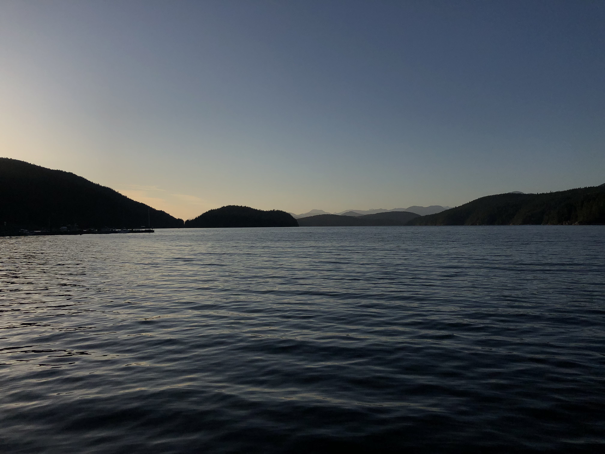

```{r setup, include=FALSE}
knitr::opts_chunk$set(echo = FALSE)
```

```{r pressure, echo=FALSE, out.width = '100%'}

```

<style>
.zoom {
  transition: transform .2s;
}

.zoom:hover {
  -ms-transform: scale(1.15); /* IE 9 */
  -webkit-transform: scale(1.15); /* Safari 3-8 */
  transform: scale(1.15); 
}

p {
  margin-bottom: 0 !Important;
}

</style>

```{r, results='asis'}
cat("<div style='
    display: grid; 
    grid-template-columns: auto auto auto;
    column-gap: 25px;
    row-gap: 15px;'>")

## Extract menu item named "Tutorials" in navbar from _site.yaml 
right_navbar = yaml::read_yaml("_site.yml")$navbar$right
for(tuts in right_navbar ) {
  if( tuts$text == "Tutorials" ) break
}

## Print logos as links to tutorial
for(t in tuts$menu) {
  
  cat("<div class='zoom'>")
  
  if(is.null(t$logo)) { 
    # print text if no logo provided
    cat(glue::glue("")) 
    }
  else { 
    cat(glue::glue("[]({t$href})")) 
  }
  cat("\n\n</div>")
}
```

<div>
